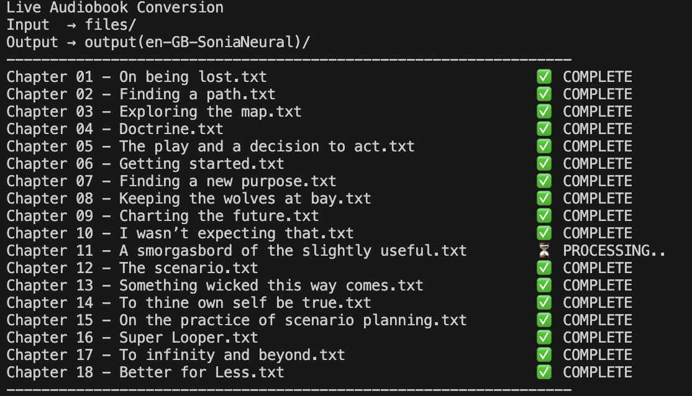

# txt2mp3

Simple python script to convert txt files to mp3.

Created it to convert Wardley Maps book by Simon Wardley to mp3.

[Existing audiobook](https://learnwardleymapping.com/book/) uses pretty old voice models, and sounds very unnatural which makes it hard to listen.

I also created [Wardley Maps NotebookLM](https://notebooklm.google.com/notebook/efed3350-b47d-49bd-88bb-b098252fc5cd), and generated podcasts for each chapter using the following prompt:
```

```

## Prereq

python3

```
pip install edge_tts
pip install asyncio
```

## Usage

1. Set `VOICE`, `INPUT_DIR` and `OUTPUT_DIR` in `txt2mp3.py` (in `=== CONFIG: CHANGE THESE ===` section)
2. Put input `.txt` files in `INPUT_DIR` directory.
3. Run script:

```
python txt2mp3.py
```

Output `.mp3` files will be created in `OUTPUT_DIR` directory.

